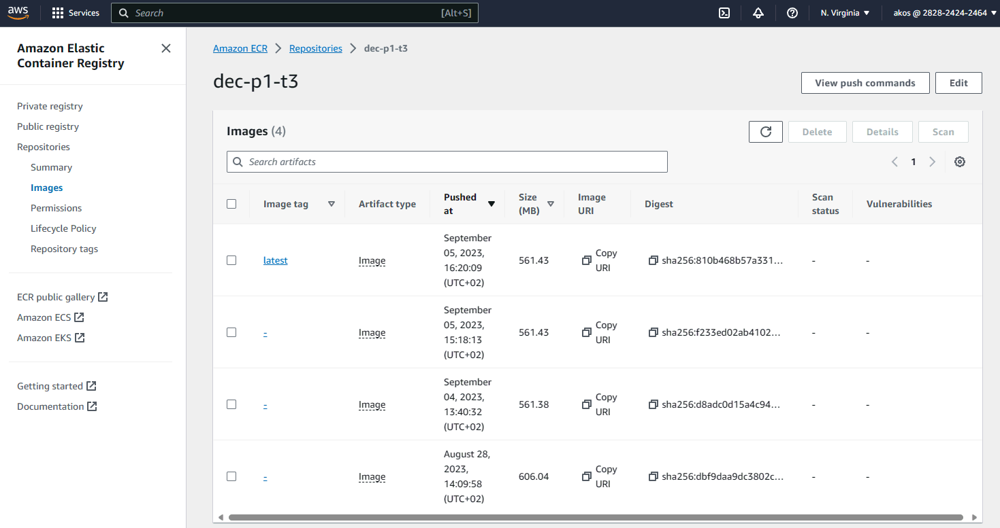
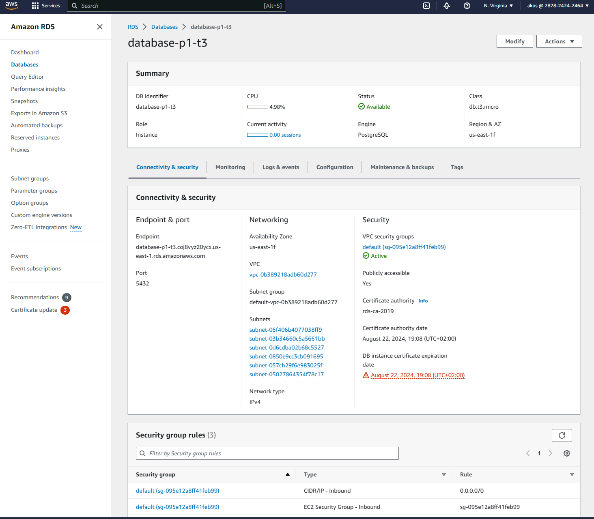
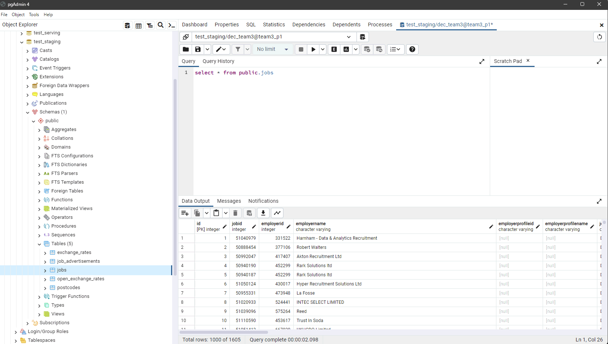

## Deploy docker container to Amazon Web Services (provide screenshot evidence of services configured/running):

### Elastic Container Service (ECS) - screenshot of scheduled task in ECS

Finished task in ECS:

Logs of task in ECS:

### Elastic Container Registry (ECR) - screenshot of image in ECR
Docker images in the ECR:

### Relational Database Service (RDS) or Simple Storage Service (S3) depending on your choice of target storage - screenshot of dataset in target storage
Database in RDS:

Query a table in RDS database:

### IAM Role - screenshot of created role
Role in IAM:

### S3 for `.env` file - screenshot of `.env` file in S3
.env file in S3:
