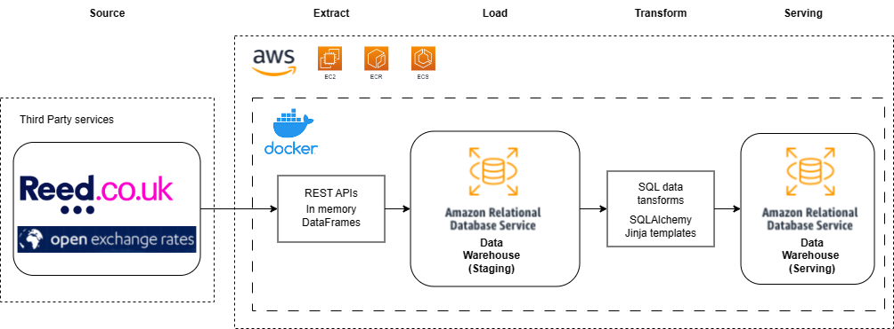

# Project plan 

## Objective 
Our project aims to track, aggregate and provide analytical datasets from data engineer jobs fetched from one (or more) job board APIs and currency exchange rates APIs.

## Consumers 
The users of our datasets are job seekers, recruiters and hiring managers.

## Questions 
 - How many jobs are there for each job title?
 - What locations have the most jobs?
 - Monitor the number of jobs for each job title over time.
 - Track the number of applicants for each job title over time.
 - Identify the most popular companies.
 - What are the average salaries for each location in different currencies?

## Source datasets 

| Source name | Source type | Source documentation |
| - | - | - |
| Reed Jobseeker API| REST API | https://www.reed.co.uk/developers/Jobseeker | 
| Open Exchange Rates API | REST API | https://docs.openexchangerates.org/reference/api-introduction | 

## Solution Architecture

## Breakdown of tasks 

### Extract and Load pipeline ~ Akos, Rihab
- Incremental extract/load
### Transform pipeline ~ Uzo
- Filtering, grouping, joins/merges
### Unit Tests ~ Rihab 
- Creating unit tests to cover the ETL Process

### Stitching the ELT pipeline together, adding logging and creating the Dockerfile for the docker image ~ Uzo, Rihab
-  Metadata logs.
-  Build a Docker image.
-  Deploy Docker container
### Creating the required AWS services (e.g. RDS, ECR, S3, ECS) ~ Akos, Uzo

### Documentation and preparing slides for the presentation ~ Uzo, Rihab, Akos

### Deploying the solution to AWS ~ Akos
